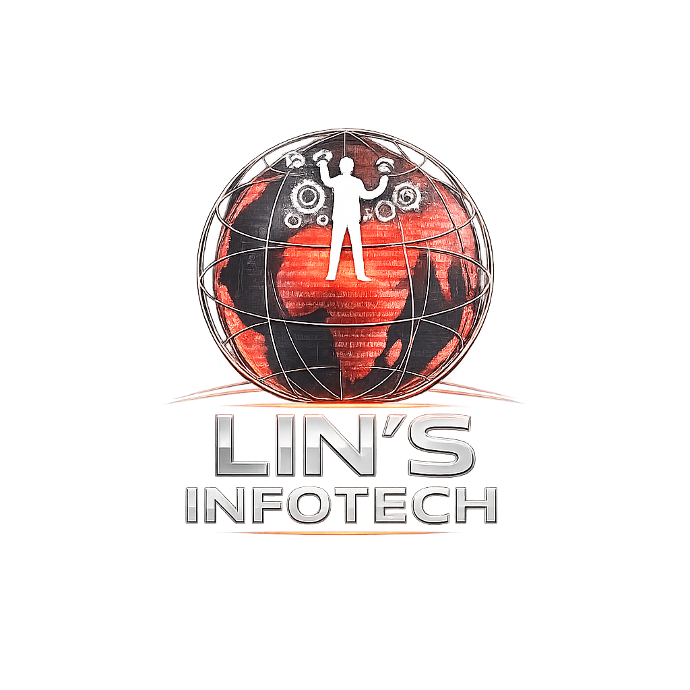
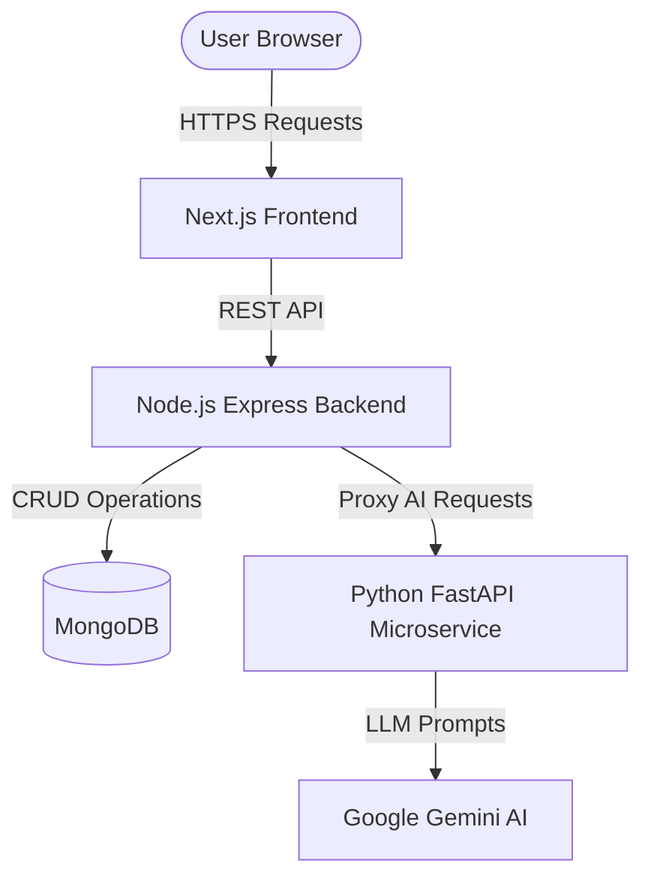

<div align="center">
  
  <h1>Lin's InfoTech | Premium AI Solutions Agency</h1>
  <p>An enterprise-grade, high-performance technology agency specializing in custom AI solutions, high-performance web development, and intelligent workflow automation for modern businesses.</p>

  <div>
    
    
    
    
    
    
  </div>
</div>

<br />

## 📖 Overview

**Lin's InfoTech** is a sophisticated, full-stack web application designed to serve as the digital storefront and lead-generation engine for an AI technology agency. The platform seamlessly integrates stunning frontend animations, a robust Node.js backend for lead capture, and a dedicated Python microservice powered by Google Gemini to offer interactive AI tools directly to clients.

## ✨ Key Features

- **Blazing Fast Frontend:** Built on Next.js App Router for optimal SEO and performance.
- **Fluid Animations:** Industry-leading GSAP and Framer Motion animations for a premium user experience.
- **AI-Powered Tools:** Features a suite of AI microservices including a project estimator, proposal generator, and an intelligent global chatbot.
- **Enterprise Backend:** Secure Node.js/Express REST API with MongoDB integration for lead management.
- **Dark/Light Mode:** Full system-aware theming with dynamic assets.
- **SEO Optimized:** Dynamic sitemap generation, structured metadata, and Google Search Console integration.

---

## 🏛️ System Architecture

The application is built on a modern **Microservices-Oriented Architecture** (MOA) divided into three distinct layers to ensure scalability and separation of concerns.

### Architecture Workflow

1. **Client Layer (Next.js Frontend):** The user interacts with the highly responsive Next.js frontend. The frontend handles routing, animations, UI state, and SEO.
2. **Core API Layer (Node.js/Express):** When a user submits a contact form, requests a callback, or interacts with the chatbot, the frontend routes the request to the Express backend. This layer handles validation, database operations (MongoDB), and CORS security.
3. **AI Computation Layer (Python/FastAPI):** For advanced AI requests (e.g., generating a full business proposal or analyzing project constraints), the Node.js backend acts as an API Gateway and forwards the payload to the isolated Python microservice. The Python service utilizes LangChain and the Google Gemini API to stream responses back through the pipeline.



---

## 💻 Tech Stack

### Frontend
- **Framework:** Next.js (App Router)
- **Language:** TypeScript
- **Styling:** Tailwind CSS
- **Animations:** GSAP, Framer Motion, Lenis (Smooth Scrolling)
- **Icons:** Lucide React

### Core Backend
- **Runtime:** Node.js
- **Framework:** Express.js
- **Database:** MongoDB (Mongoose)
- **Security:** Helmet, CORS, Rate Limiting

### AI Microservice
- **Language:** Python 3.10+
- **Framework:** FastAPI
- **AI Orchestration:** LangChain
- **LLM Provider:** Google Gemini API

---

## 📂 Project Structure

```text
├── frontend/             # Next.js Application
│   ├── public/           # Static assets, fonts, icons, sitemap
│   ├── src/app/          # App Router pages and layouts
│   └── src/components/   # Reusable UI components & GSAP animations
├── backend/              # Node.js/Express API
│   ├── controllers/      # Route logic & AI proxying
│   ├── models/           # MongoDB schemas
│   └── routes/           # API endpoint definitions
└── ai-services/          # Python/FastAPI Microservice
    ├── routers/          # AI endpoints (Chatbot, Proposal, Estimator)
    └── utils/            # LangChain and Gemini configuration
```

---

## 🚀 Setup & Installation

### Prerequisites
- Node.js (v18+)
- Python (3.10+)
- MongoDB URI
- Google Gemini API Key

### Global Setup
1. Clone the repository:
   ```bash
   git clone https://github.com/VeeraVaishnaviK/Lin-s-InfoTech-Website.git
   cd Lin-s-InfoTech-Website
   ```
2. You can start the entire stack simultaneously using the provided startup scripts (Windows):
   ```bash
   ./start_project.ps1
   ```

*(Alternatively, you can start each service individually by installing their respective dependencies and running their dev commands).*

---

## 👨‍💻 Developer

**Veera Vaishnavi K**
- **Full Stack Developer** | **AI Solutions Developer**
- **Google Developer Groups (GDG)** Co-Organizer
- **Student Ambassador** — Institution's Innovation Council (IIC)

### Links:
- **GitHub:** [https://github.com/VeeraVaishnaviK](https://github.com/VeeraVaishnaviK)
- **Website:** [apexengineering.org.in](https://apexengineering.org.in)
- **LinkedIn:** [https://www.linkedin.com/in/veera-vaishnavi/](https://www.linkedin.com/in/veera-vaishnavi/)

---

## 📄 License

This project is licensed under the **MIT License**.
